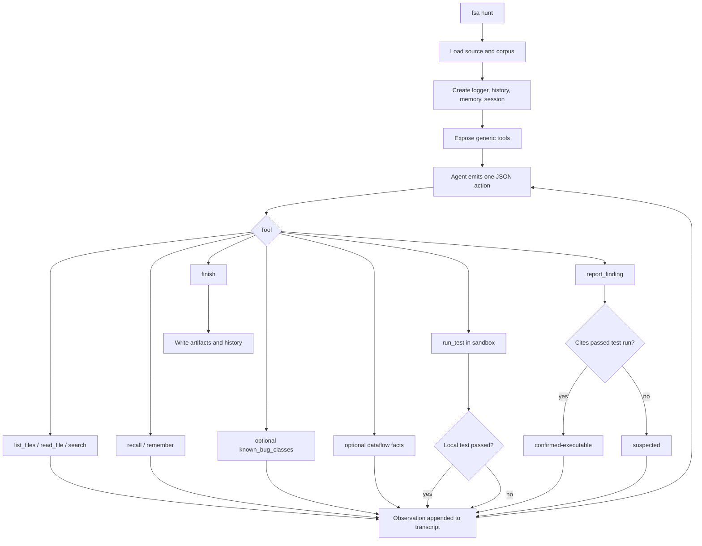

# full-stack-auditor

White-hat security audit framework for autonomous, model-driven source investigation.

The public workflow is `fsa hunt`: a thin agentic loop where the model decides what to read, search, test, remember, and report. The framework provides capability and guarantees, not strategy.

```bash
fsa hunt --target my-target --source ./src --corpus ./docs --max-steps 40
```

## Design Principle

The framework should only do what the model cannot safely or physically do for itself:

- load authorized source and reference material;
- expose generic tools for reading, searching, testing, recalling, and reporting;
- run local tests inside an isolated workspace;
- enforce command safety and public-release hygiene;
- persist a replayable transcript, reports, and project memory;
- keep the hard confirmation boundary: a claim is not executable-confirmed until a local test proves it.

Everything about what might be a bug and how to investigate it belongs to the agent.

## Agentic Flow



## Tools

The hunt tool surface is intentionally small:

- `list_files`: list loaded source or corpus files.
- `read_file`: read a loaded file or line range.
- `search`: regex search over loaded material.
- `run_test`: run one local test in a copied sandbox workspace.
- `report_finding`: record a candidate vulnerability.
- `recall` / `remember`: use per-target durable memory.
- `finish`: end the hunt.

Two legacy planning aids are exposed only as optional tools, not injected strategy:

- `known_bug_classes`: reference library of common bug classes.
- `dataflow`: machine-extracted provenance facts. These are routing facts only, never findings.

## Confirmation

Findings use two statuses in hunt mode:

- `suspected`: the agent reported a candidate without a passing cited local test.
- `confirmed-executable`: the agent cited a `run_test` record that passed in the sandbox.

The framework checks the recorded test result. The model cannot upgrade a finding by assertion. Local execution must stay local: unit tests, fixtures, regtest/devnet, forked local nodes, or isolated harnesses only.

## Install

```bash
npm install
npm run build
npm test
```

For live model runs, configure provider credentials in your shell or secret manager according to the pi-ai provider documentation. Do not commit credentials, local environment files, private corpora, or machine-specific paths.

## Running Hunts

Basic live hunt:

```bash
fsa hunt \
  --target protocol-audit \
  --source ./src ./contracts \
  --corpus ./docs ./specs \
  --provider openai \
  --model gpt-5.5 \
  --thinking xhigh \
  --max-steps 40
```

Offline smoke test with the deterministic mock model:

```bash
npm run mock-hunt
```

Local seeder regression check:

```bash
npm run check:blind-discovery
```

Public-surface scan:

```bash
npm run check:public
```

Full local verification gate:

```bash
npm run verify
```

## Reproduction

`fsa hunt` can call `run_test` during the hunt. You can also run reproduction work later against an existing run:

```bash
fsa reproduce \
  --run runs/<target-run> \
  --source <source-paths...> \
  --repro execute \
  --verify-top 100
```

Reproduction writes files only inside a copied workspace under the run directory. It does not modify the target source tree. Command safety blocks public-network broadcast, transfer, credential, persistence, and exploit-optimization flows.

## Domain Profiles

Config files under `configs/` can still provide source paths, corpus paths, project context, and optional domain hints. In hunt mode, these are context, not a framework-owned checklist.

Examples:

```bash
fsa hunt \
  --config ./configs/solidity-contract-hunt.default.json \
  --target contract-audit \
  --source <contract-source-paths...> \
  --corpus <specs-docs-and-prior-audit-material...> \
  --provider openai \
  --model gpt-5.5
```

```bash
fsa hunt \
  --config ./configs/cairo-starknet-hunt.default.json \
  --target starknet-audit \
  --source <cairo-and-contract-source-paths...> \
  --corpus <specs-docs-and-prior-audit-material...> \
  --provider openai \
  --model gpt-5.5
```

See [docs/SOLIDITY.md](docs/SOLIDITY.md) and [docs/STARKNET.md](docs/STARKNET.md).

## Pi Package

Try the package locally from this directory:

```bash
pi -e .
```

The extension registers `fsa_hunt` and installs the shared command-safety guardrail for shell commands.

## Outputs

Each hunt writes:

- `hunt_transcript.json`: replayable action/observation trace.
- `hunt_findings.json`: raw agent-reported findings.
- `hunt_test_runs.json`: local sandbox test records.
- `summary.json`: ranked finding summary and coverage.
- `report_<id>.md`: private disclosure drafts.
- `events.jsonl` and `calls/*.json`: audit trace and model-call records.
- `<out>/history/<target>/memory.jsonl`: durable per-target memory.
- `<out>/history/<target>/manifest.json`: project-level history.

Run artifacts are private by default. Redact before sharing outside the trusted project context.

## Library API

```ts
import { defaultConfig, runHunt, MockAuditLlmClient } from "full-stack-auditor";

const cfg = defaultConfig();
cfg.targetName = "example";
cfg.sourcePaths = ["./fixtures"];

const result = await runHunt(cfg, { llm: new MockAuditLlmClient() });
console.log(result.runDir);
```

Use `full-stack-auditor/pi/extension` for the pi package extension entrypoint.

## White-Hat Rules

- Audit only authorized code or public bug-bounty scope.
- Verification must be local-only: unit tests, regtest, devnet, forked local node, or isolated harness.
- Never broadcast or execute against public testnet/mainnet.
- Do not write value-extraction exploits, exfiltrate data, or read secrets.
- Build the smallest local proof needed to confirm or refute the invariant break.
- Report privately and coordinate disclosure.

## Contributing And Security

See [CONTRIBUTING.md](CONTRIBUTING.md) and [SECURITY.md](SECURITY.md).
