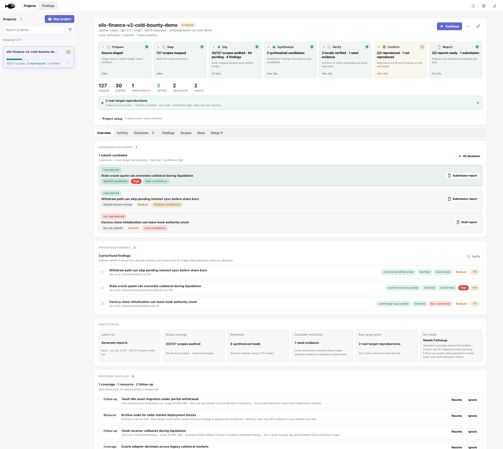

<p align="center"></p>

<h1 align="center">Flounder</h1>

<p align="center"><strong>An autonomous white-hat security auditor.</strong><br/>Target prep, audit, exploit construction, and execution-grounded proof.</p>

<p align="center">
  <a href="docs/USAGE.md">Usage</a> ·
  <a href="docs/ARCHITECTURE.md">Architecture</a> ·
  <a href="SECURITY.md">Security</a> ·
  <a href="CONTRIBUTING.md">Contributing</a>
</p>

---

Flounder turns coding agents into an end-to-end security audit system. Give it an authorized target — a repository, source tree, package, or on-chain clue — and it prepares the workspace, maps the attack surface, digs into promising regions, constructs exploit paths, runs local proof tests in a sandbox, and reproduces confirmed findings against real-world ground truth. The model does the reasoning; Flounder supplies the sandbox, command policy, durable state, execution gates, daemon control plane, and reporting.

> **This fork** adds a standalone **`openai-compatible` provider type** and ships a **Docker image published to GHCR**, so you can point Flounder at any OpenAI-compatible endpoint and deploy it as a container.

<p align="center"></p>

## Quickstart

### Docker (published image)

```bash
docker run -d -p 4500:4500 \
  -e FLOUNDER_UI_TOKEN=$(openssl rand -hex 16) \
  -v flounder-data:/root/.flounder \
  -v /var/run/docker.sock:/var/run/docker.sock \
  ghcr.io/lollipopkit/flounder:latest
```

- `FLOUNDER_UI_TOKEN` is required to bind on `0.0.0.0`; clients then send `Authorization: Bearer <token>`.
- Mount the host Docker socket so sandbox execution (docker-out-of-docker) can run audit PoCs.
- Image tags follow git tags: `:latest`, `:0.3`, `:0.3.45`.

### From source

```bash
nvm use            # Node 24 (pinned in .nvmrc)
npm install
npm run build
npm run sandbox:build
node dist/cli.js ui
```

## OpenAI-compatible provider

This fork exposes `openai-compatible` as its own provider in the dashboard, driven by env vars:

```bash
FLOUNDER_OPENAI_COMPAT_BASE_URL=https://your-endpoint/v1
FLOUNDER_OPENAI_COMPAT_MODEL=your-model-id
FLOUNDER_OPENAI_COMPAT_API_KEY=sk-...
```

Then pick `openai-compatible` in Settings and create a provider profile with your model. Requests are routed through the standard OpenAI-completions client, so any compatible gateway (local proxy, self-hosted, aggregator) works.

## Drive it with an agent

```bash
npx skills add lollipopkit/flounder --skill flounder -g -a codex -a claude-code
```

Then ask naturally: *"Audit this repository with Flounder."* The operating manual is [skills/flounder/SKILL.md](skills/flounder/SKILL.md).

## Workflow

`flounder run <clue>` executes the tracked pipeline end to end:

**prepare → map → dig → synthesize → verify → confirm → report**

```bash
# Prepare a target from a repo/link/tx/address, then audit → confirm → report.
flounder run https://github.com/org/protocol

# Audit source already staged locally (sealed map/dig).
flounder run --target my-target --source ./src --build-root . --corpus ./docs

# Reproduce a run's confirmed findings against real ground truth.
flounder confirm ~/.flounder/my-target-<timestamp> --source ./src --build-root .
```

Each phase is also a standalone verb (`prepare`, `map`, `audit`, `verify`, `confirm`, `report`) and a REST call — `GET /api` returns a self-describing catalog. Full command, provider, daemon, and API reference: [docs/USAGE.md](docs/USAGE.md).

## Why it's different

- **Framework-agnostic.** No hard-coded per-stack rules; the audit strategy comes from the model. Strong fit for Solidity/EVM and ZK, where local forks and prover harnesses turn subtle bugs into executable counterexamples.
- **Execution-grounded.** A finding is real only when it cites a passing local command that exercises the vulnerable path — not model assertion. Stronger findings also pass differential and independent-refutation checks.
- **Sandboxed.** Model-generated PoCs run in a copied workspace under an OCI sandbox that fails closed if no engine is ready, never on the host checkout.
- **Local control.** The UI is a control plane; audits run on a daemon (optionally remote), so target code and provider credentials stay on the executor host.

## Sandbox

Real audits execute model commands through `--sandbox-backend auto` (Docker-backed OCI by default; Apple `container` on Apple silicon). Build the default image with `npm run sandbox:build`, or bring your own with `--sandbox-image your-image:latest`. Host execution (`--sandbox-backend host --allow-host-execution`) is for trusted local smoke tests only. Details in [docs/USAGE.md](docs/USAGE.md).

## White-hat boundary

Flounder is for authorized targets: public source, your own code, client-authorized scope, or public bug-bounty programs. Sealed discovery is local-only. Confirmation may fetch/fork/read but must never broadcast transactions, move funds, submit writes, persist access, or target out-of-scope systems. See [SECURITY.md](SECURITY.md).

## Documentation

- [Usage](docs/USAGE.md) — commands, sandbox, dashboard, API, providers, daemon, outputs
- [Architecture](docs/ARCHITECTURE.md) — thin-agent design, sandbox/confirmation boundaries, control/execution split
- [Agent skill](skills/flounder/SKILL.md) — Codex / Claude Code operating manual
- [Security](SECURITY.md) · [Validation](docs/VALIDATION.md) · [Versioned coverage](docs/VERSIONED_COVERAGE_LOOP.md)

## License

AGPL v3. See [CONTRIBUTING.md](CONTRIBUTING.md).
