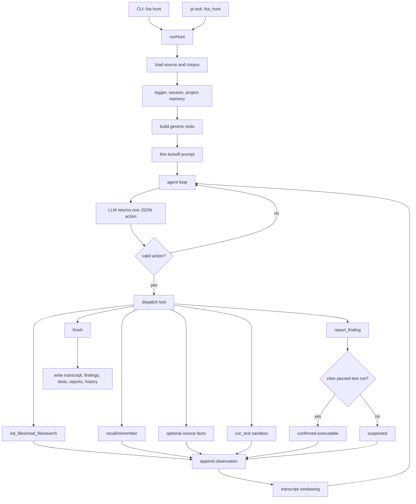

# Architecture

## Boundary

`full-stack-auditor` is now centered on the thin agentic hunt path. The public driver is `fsa hunt`; the model decides the audit strategy and the framework supplies only capabilities, safety, confirmation gates, and replayable state.

The main layers are:

- Agent loop: `src/agent/loop.ts`, `src/agent/prompts.ts`, and `src/agent/hunt.ts`.
- Agent tools: `src/agent/tools.ts` for read/search/source facts/local tests/reporting/memory.
- Ingestion: `src/ingest/source.ts` loads authorized source and corpus material with public-safe paths.
- Safety: `src/security/policy.ts` and `src/security/sandbox.ts` gate local command execution.
- Reporting and history: `src/reports`, `src/trace`, and `src/agent/memory.ts`.
- Provider adapters: `src/llm/pi-ai.ts`, with explicit local CLI fallbacks in `src/llm/codex-cli.ts` and `src/llm/claude-code.ts`.
- Pi integration: `src/pi/extension.ts` registers the `fsa_hunt` tool and shell guardrail.

## Hunt Flow

The loop has one protocol: the model emits exactly one JSON action per turn. The framework parses it, runs the requested tool, appends the observation, and calls the model again until the agent finishes or the step budget is exhausted.

## Thin-Layer Rule

A component belongs in hunt mode only if it gives the model something it cannot provide for itself:

- an affordance: read source, search source, inspect corpus, run a local test, recall prior work;
- a guarantee: sandbox isolation, command safety, path redaction, replayable logs, durable history, executable-confirmation gating.

A component does not belong in the default hunt path if it tells the model what bug class to look for, what schedule to follow, or what conclusion to reach. If a human prior is still useful, expose it as an optional model-callable tool.

## Tool Surface

Default tools:

- `list_files`: enumerate loaded source/corpus files.
- `read_file`: read a file or line range from loaded material.
- `search`: regex search over loaded material.
- `run_test`: write bounded files into a copied workspace and run one allowed local test command.
- `report_finding`: record a candidate finding.
- `recall` / `remember`: use durable per-target memory.
- `finish`: stop the hunt.

Optional planning aids:

- `known_bug_classes`: a reference library only. It is not an enforced taxonomy.
- `dataflow`: machine-extracted provenance facts only. It is not a detector and cannot produce findings.

## Confirmation Boundary

The hard rule is that the model cannot confirm a bug by assertion.

`report_finding` records `confirmed-executable` only when it cites a `run_test` record that passed. Otherwise it records `suspected`.

`run_test` routes through `src/security/sandbox.ts` and the command-safety policy. It must stay local-only: unit tests, fixtures, local regtest/devnet, forked local nodes, or isolated harnesses. Public network broadcast, transfer, credential use, persistence, exploit optimization, and destructive commands are blocked.

The next hardening target is to make executable confirmation less self-certifying: a generic passing test or printed success string should not be enough to prove exploitability. Confirmation should prefer tests that touch target code, exercise the vulnerable condition, and match framework- or verifier-owned success signals.

## Memory And History

Each hunt writes:

- `hunt_transcript.json`: action/observation replay.
- `hunt_findings.json`: raw agent findings.
- `hunt_test_runs.json`: sandboxed local test records.
- `summary.json`: ranked summary.
- `report_<id>.md`: private disclosure drafts.
- `events.jsonl` and `calls/*.json`: trace and model calls.

Per-target memory lives at `<out>/history/<target>/memory.jsonl`. The framework stores notes; the model decides what to remember and when to recall.

Project history lives under `<out>/history/<target>/manifest.json` and records sanitized run metadata, findings, and materials. Paths must stay repository-relative or placeholder-based in public-facing artifacts.

## Provider Behavior

Model calls use pi-ai providers by default. `provider=codex-cli` and `provider=claude-code` are explicit local CLI fallbacks. CLI fallbacks run non-interactively and must preserve the hunt contract: in agentic mode they must not inject "do not inspect files" instructions, because the framework tools are how the model investigates.

Model and provider selection stays runtime-configured. Do not assume every model family is available through every provider.

## Pi Integration

The package extension exposes `fsa_hunt` and installs the shared shell-command guardrail. It does not expose a staged audit driver.

The command guardrail lives in `src/security/policy.ts` so non-pi integrations can reuse the same policy.

## Runnable Gates

- `npm run check`: strict TypeScript compile.
- `npm test`: build plus Node tests.
- `npm run mock-hunt`: deterministic offline hunt smoke test.
- `npm run check:blind-discovery`: local seeder regression check for optional planning aids.
- `npm run check:public`: public-surface scan for secrets and local paths.
- `npm run verify`: full local gate.

## White-Hat Constraints

- Audit only authorized source code.
- Keep verification local-only.
- Never broadcast transactions or target public networks.
- Treat model output as untrusted input.
- Validate structured output and sanitize paths.
- Keep audit artifacts private by default.
